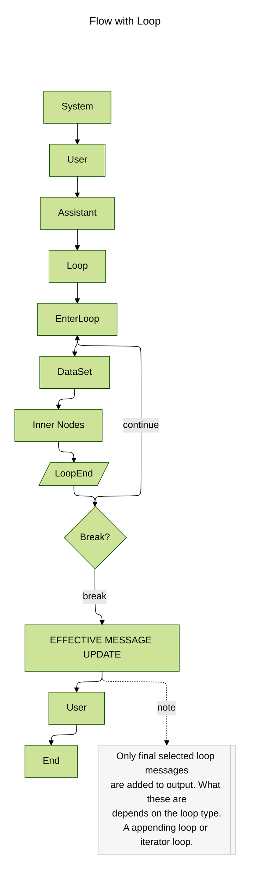

Todo
=====

- [ ] Overhaul how state is tracked.

Walk across flow graph generating message nodes as we go rather than walking across entire graph before running inference.

Track metadata if requested. If we reach a node that needs to run inference before proceeding verify we have model settings set already.

On inference output nodes (messages) append meta data - effective model, settings, etc. at time of generation. 

On loop nodes and tagged nodes store state values (sans message thread) - i.e. effective values. 

We need to segment out state from message thread. Once reaching final node run inference with effective thread at that point. 

Internally output loop nodes need to track all paths through (if in report mode execute) plus the final effective messages added to thread. 

---------------------

# Model Details
- [ ] Overhaul how model details are loaded to incorporate a model database to fill in model internal details.
  - [ ] Context Limits
  - [ ] Function Call Support
  - [ ] Image Support
  - [ ] Audio Support
  - [ ] Video Support

# Providers
- [ ] Add support for HuggingFace
- [ ] Add support for OpenVllm
- [ ] Update API Call logic for Anthropic to use updated api format.
- [ ] Vision Support for Groq models that support it.
- [ ] Tool use via api for Groq models that support it.

# Local Llama
- [ ] Move LocalLama to extension/add-on module
