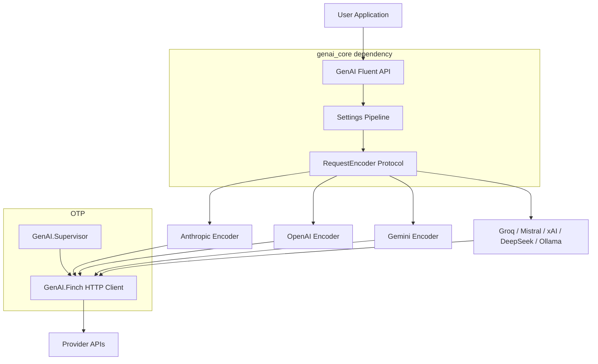

# Project Architecture

## Overview

GenAI is an Elixir library that provides a unified interface for multiple generative AI providers. It uses Elixir protocols and OTP behaviours to abstract provider differences behind a consistent API. The core abstractions (`GenAI`, `GenAI.Message`, `GenAI.Model`, etc.) live in a separate `genai_core` dependency; this repo contains the provider implementations and the OTP application that ties them together.

## System Diagram

## Core Components

| Component | Purpose |
|-----------|---------|
| `genai_core` (dep) | Core abstractions: `GenAI` module, message types, model protocol, behaviours |
| `GenAI.Application` | OTP supervisor — starts `GenAI.Finch` HTTP connection pool |
| `GenAI.InferenceProviderBehaviour` | Behaviour each provider `use`s for model listing and API calls |
| `GenAI.Model.EncoderBehaviour` | Behaviour each encoder `use`s for request construction |
| `GenAI.RequestEncoder` | Protocol dispatching encoding to the correct provider encoder |
| Provider `EncoderProtocol` | Per-provider protocol for encoding messages, tools, and content types |

## Provider Architecture

All 8 providers follow a consistent three-layer pattern. Providers with OpenAI-compatible APIs (Groq, xAI, DeepSeek) share similar encoder structures with minimal customization.

-> *See [arch/providers.md](arch/providers.md) for details*

## Request Lifecycle

A chat completion flows through: settings pipeline -> model resolution -> encoder dispatch -> HTTP request -> response parsing -> `GenAI.ChatCompletion` struct.

-> *See [arch/request-lifecycle.md](arch/request-lifecycle.md) for details*

## Key Decisions

- **Protocol-based encoding**: Allows third parties to add new message/content types by implementing the provider's `EncoderProtocol` without modifying existing code
- **Separate `genai_core`**: Core abstractions are a standalone Hex dependency, keeping this repo focused on provider implementations
- **Finch for HTTP**: Managed under OTP supervision for connection pooling and reliability
- **Settings pipeline**: Layered precedence (options > model > provider > global > config) resolved at encode time via `search_scope` lists

## Technology Stack

| Layer | Technology |
|-------|-----------|
| Language | Elixir 1.16+ / Erlang 26 |
| HTTP | Finch (connection pooling, OTP-supervised) |
| JSON | Jason |
| Testing | ExUnit + Mimic (mocking) |
| Static Analysis | Dialyxir + Credo |
| Documentation | ExDoc |
