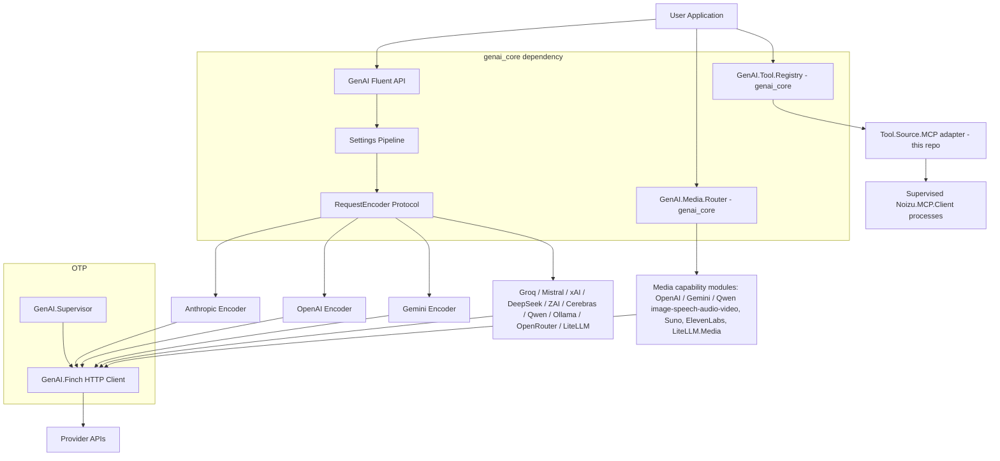

# Project Architecture

## Overview

GenAI is an Elixir library that provides a unified interface for multiple generative AI providers. It uses Elixir protocols and OTP behaviours to abstract provider differences behind a consistent API. The core abstractions (`GenAI`, `GenAI.Message`, `GenAI.Model`, `GenAI.Media.Router`, …) live in a separate `genai_core` dependency; this repo contains the provider implementations — chat, media, and voice — plus the OTP application and the MCP tool-source adapter that ties them together.

## System Diagram

```mermaid
graph TB
    App[User Application] --> API[GenAI Fluent API]
    API --> Settings[Settings Pipeline]
    Settings --> Encoder[RequestEncoder Protocol]
    Encoder --> Anthropic[Anthropic Encoder]
    Encoder --> OpenAI[OpenAI Encoder]
    Encoder --> Gemini[Gemini Encoder]
    Encoder --> Others[Groq / Mistral / xAI / DeepSeek / ZAI / Cerebras / Qwen / Ollama / OpenRouter / LiteLLM]
    Anthropic --> Finch[GenAI.Finch HTTP Client]
    OpenAI --> Finch
    Gemini --> Finch
    Others --> Finch
    Finch --> APIs[Provider APIs]

    App --> MRouter[GenAI.Media.Router - genai_core]
    MRouter --> Media[Media capability modules: OpenAI / Gemini / Qwen image-speech-audio-video, Suno, ElevenLabs, LiteLLM.Media]
    Media --> Finch

    App --> Tools[GenAI.Tool.Registry - genai_core]
    Tools --> MCP[Tool.Source.MCP adapter - this repo]
    MCP --> MCPClients[Supervised Noizu.MCP.Client processes]

    subgraph OTP
        Supervisor[GenAI.Supervisor] --> Finch
    end

    subgraph genai_core [genai_core dependency]
        API
        Settings
        Encoder
        MRouter
        Tools
    end
```

## Core Components

| Component | Purpose |
|-----------|---------|
| `genai_core` (dep) | Core abstractions: `GenAI` module, message types, model protocol, behaviours, `GenAI.Media.Router`/`Request`/`Job`, `GenAI.Tool.Registry` |
| `GenAI.Application` | OTP supervisor — starts `GenAI.Finch` HTTP connection pool |
| `GenAI.InferenceProviderBehaviour` | Behaviour each provider `use`s for model listing and API calls |
| `GenAI.Model.EncoderBehaviour` | Behaviour each encoder `use`s for request construction |
| `GenAI.RequestEncoder` | Protocol dispatching encoding to the correct provider encoder |
| Provider `EncoderProtocol` | Per-provider protocol for encoding messages, tools, and content types |
| Media capability modules | `{provider}/{image,speech,audio,transcription,video,media}.ex` — registered in `config :genai, :media_providers` and routed by modality |
| `GenAI.Tool.Source.MCP` | Adapts supervised MCP clients into the tool registry (`source_id__tool_name` namespacing; `:noizu_mcp` optional at runtime) |

→ *Components ↔ directories: see [PROJ-LAYOUT.md](PROJ-LAYOUT.md)*

## Provider Architecture

All chat providers follow a consistent three-layer pattern. Providers with OpenAI-compatible APIs (Groq, xAI, DeepSeek, ZAI, Cerebras, Qwen, OpenRouter, LiteLLM) share similar encoder structures with minimal customization; media-only providers (Suno, ElevenLabs) are flat modules exposing capability functions.

-> *See [arch/providers.md](arch/providers.md) for details*

## Request Lifecycle

A chat completion flows through: settings pipeline -> model resolution -> encoder dispatch -> HTTP request -> response parsing -> `GenAI.ChatCompletion` struct.

-> *See [arch/request-lifecycle.md](arch/request-lifecycle.md) for details*

## Media Architecture

Media generation (image / speech / audio / transcription / video / music) routes through `GenAI.Media.Router` (in `genai_core`), which walks the ordered `:media_providers` config list and selects the first provider declaring the requested (input, output) modality. Specific providers are listed before the LiteLLM proxy so they win where both can serve; LiteLLM acts as the gateway fallback. Job polling/status lives in `GenAI.Media.Job` (core); this repo contributes only the capability modules.

## Tool Sources (MCP)

Tools for `run_with_tools/3` come from `GenAI.Tool.Registry` (core). This repo's `GenAI.Tool.Source.MCP` snapshots tools from supervised `Noizu.MCP.Client` processes under stable `source_id__tool_name` names. The client is an optional runtime dependency — absent `:noizu_mcp`, registration and calls fail fast with `{:missing_optional_dependency, :noizu_mcp}`. See [PROJ-SCHEMA.md](PROJ-SCHEMA.md) for the normalized tool/result shapes and safety options.

## Key Decisions

- **Protocol-based encoding**: Allows third parties to add new message/content types by implementing the provider's `EncoderProtocol` without modifying existing code
- **Separate `genai_core`**: Core abstractions are a standalone Hex dependency, keeping this repo focused on provider implementations
- **Finch for HTTP**: Managed under OTP supervision for connection pooling and reliability
- **Settings pipeline**: Layered precedence (options > model > provider > global > config) resolved at encode time via `search_scope` lists
- **Ordered media registry (ADR-016)**: Modality routing via config order rather than hardcoded dispatch — consumers can reorder or override per-environment
- **Runtime-optional MCP**: `Code.ensure_loaded?` gating keeps the Elixir 1.16 floor and avoids forcing `:noizu_mcp` on non-MCP consumers

## Technology Stack

| Layer | Technology |
|-------|-----------|
| Language | Elixir 1.16+ / Erlang 26 |
| HTTP | Finch (connection pooling, OTP-supervised) |
| JSON | Jason |
| Tool sourcing (optional) | `noizu_mcp` (`Noizu.MCP.Client`) |
| Testing | ExUnit + Mimic (mocking), JUnit formatter for CI |
| Static Analysis | Dialyxir + Credo |
| Documentation | ExDoc |
