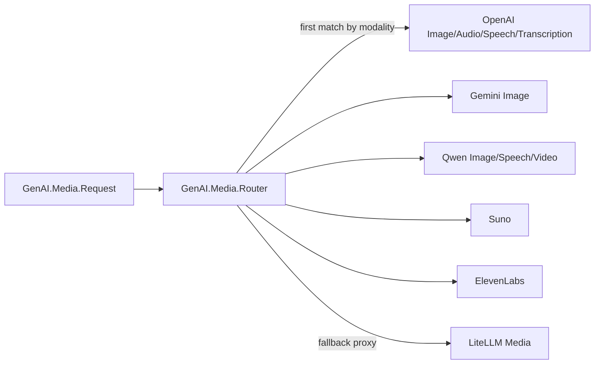

# Project Schema

GenAI is a **library, not a service**: it owns no database, no migrations, and no KV store. The structured data in this repo is (1) mix/runtime configuration, (2) environment-variable contracts, (3) the provider media-routing registry, and (4) the MCP tool-source interface contract. Core request/response structs (`GenAI.Message`, `GenAI.Thread`, `GenAI.Model`, …) live in the sibling `genai_core` dependency — documented there, consumed here.

Code locations for each schema below are mapped in [PROJ-LAYOUT.md](PROJ-LAYOUT.md).

## Runtime Configuration (mix config)

Loaded from `config/config.exs` → `config/{env}.exs` (env file wins). Consumers may override every key per-environment.

### `config :genai, :local_llama`

| Key | Type | Default | Description |
|-----|------|---------|-------------|
| enabled | boolean | `true` | Local llama support toggle |
| otp_app | atom | `:genai` | OTP app for asset resolution |

### `config :genai, :media_providers` — media routing registry (ADR-016)

An **ordered list** of provider modules; `GenAI.Media.Router` walks it and picks the first provider declaring the requested (input, output) modality. Specific providers precede the LiteLLM proxy so they win for modalities both can serve.

Order as shipped: `OpenAI.Image, Gemini.Image, Qwen.Image, OpenAI.Audio, OpenAI.Speech, Qwen.Speech, OpenAI.Transcription, Qwen.Video, Suno, ElevenLabs, LiteLLM.Media`.

### Per-provider `config :genai, <provider>, ...`

Configured in `config/test.exs` (and mirrored by consumers); each key reads env at config-load time.

| Config key | Fields | Env source | Default |
|-----------|--------|-----------|---------|
| `:anthropic` | `api_key` | `ANTHROPIC_API_KEY` | — |
| `:openai` | `api_key` | `OPENAI_API_KEY` | — |
| `:gemini` | `api_key` | `GEMINI_API_KEY` | — |
| `:mistral` | `api_key` | `MISTRAL_API_KEY` | — |
| `:groq` | `api_key` | `GROQ_API_KEY` | — |
| `:xai` | `api_key` | `XAI_API_KEY` | — |
| `:deepseek` | `api_key` | `DEEPSEEK_API_KEY` | — |
| `:zai` | `api_key` | `ZAI_API_KEY` | — |
| `:cerebras` | `api_key` | `CEREBRAS_API_KEY` | — |
| `:openrouter` | `api_key`, `http_referer`, `app_title` | `OPENROUTER_API_KEY`, `OPENROUTER_HTTP_REFERER`, `OPENROUTER_APP_TITLE` | `https://github.com/noizu-labs-ml/genai` / `"Noizu GenAI"` |
| `:qwen` | `api_key`, `token_api_key`, `token_plan`, `base_url`, `token_plan_base_url` | `QWEN_API_KEY` (fallback `DASHSCOPE_API_KEY`), `QWEN_TOKEN_KEY`, —, `QWEN_BASE_URL`, `QWEN_TOKEN_BASE_URL` | `token_plan: false`; intl compatible-mode / Singapore token-plan hosts |
| `:litellm` | `api_key`, `base_url` | `LITELLM_API_KEY`, `LITELLM_BASE_URL` | `http://localhost:4000` |
| `:suno` | `api_key`, `base_url` | `SUNO_API_KEY`, `SUNO_BASE_URL` | `https://api.sunoapi.org` |
| `:ollama` | base url only, read at call time | `OLLAMA_BASE_URL` | `http://localhost:11434` |

Additional runtime env read directly by `lib/` code: `ELEVENLABS_API_KEY` (ElevenLabs provider).

`.envrc` (gitignored, direnv) is the local carrier for all of the above — never commit values.

## Data Interface: MCP Tool Source (`lib/genai/tool/source/mcp.ex`)

Adapts a supervised `Noizu.MCP.Client` to the `GenAI.Tool.Source` behaviour. `:noizu_mcp` is an **optional** dependency — checked at runtime via `Code.ensure_loaded?/1`; absent ⇒ `{:error, {:missing_optional_dependency, :noizu_mcp}}`.

**Tool naming contract**: tools are exposed as `source_id__tool_name` (two underscores), where `source_id` is caller-supplied and stable across VM restarts — never inferred from pids.

### Normalized tool shape (into `GenAI.Tool.new/1`)

| Field | Source (MCP) | Fallback |
|-------|--------------|----------|
| name | `name` | — |
| description | `description` | `""` |
| parameters (JSON Schema) | `input_schema` / `inputSchema` | `{"type": "object", "properties": {}}` |
| meta.protocol | constant | `"mcp"` |
| meta.title / output_schema / annotations / icons | same-named fields (`output_schema` / `outputSchema`) | dropped when nil |
| meta.mcp_meta | server `_meta` | **excluded** unless `include_mcp_meta: true` |

### Tool-result payload shape

| Field | Source | Notes |
|-------|--------|-------|
| content | `content` (wrapped to list, per-item nil keys stripped) | always present |
| structured_content | `structured` / `structuredContent` | |
| is_error | `is_error` / `isError` == true | `true` ⇒ `{:error, payload}` |

All values pass through `json_safe/1`: atoms stringify, tuples become lists, unsupported terms are `inspect/1`-represented — no atoms are created from remote keys.

### Options

| Option | Default | Effect |
|--------|---------|--------|
| `include_mcp_meta` | `false` | Forward server `_meta` into tool meta / results (trusted servers only) |
| `include_payloads` | `false` | Registry telemetry records arguments/results |
| `mcp_options` | `[]` | Explicit passthrough, merged over forwarded options |
| forwarded | — | `:progress`, `:progress_token`, `:telemetry_metadata`, `:timeout` |

## Core Structs (external — `genai_core`)

`GenAI.Message` (roles: `:system`, `:user`, `:assistant`, `:tool`), `GenAI.Thread`, `GenAI.Model`, `GenAI.Tool`, and the `GenAI.RequestEncoder` protocol are defined in the sibling `ai/genai-core` library. This repo contributes only provider-specific encoders and model catalogs (`{provider}/models.ex`).

## Fixtures / Data Files

| Path | Purpose | Shape |
|------|---------|-------|
| `priv/media/kitten.jpeg` | Vision/media test input | JPEG image (gitignored tree, tracked path) |

## Test Environment Interface

`config/test.exs` also configures `:junit_formatter` (`report_file: "results.xml"`) — CI consumes the JUnit XML. Test tags `@tag :live` / `@tag :advanced` gate API-key-dependent suites.
