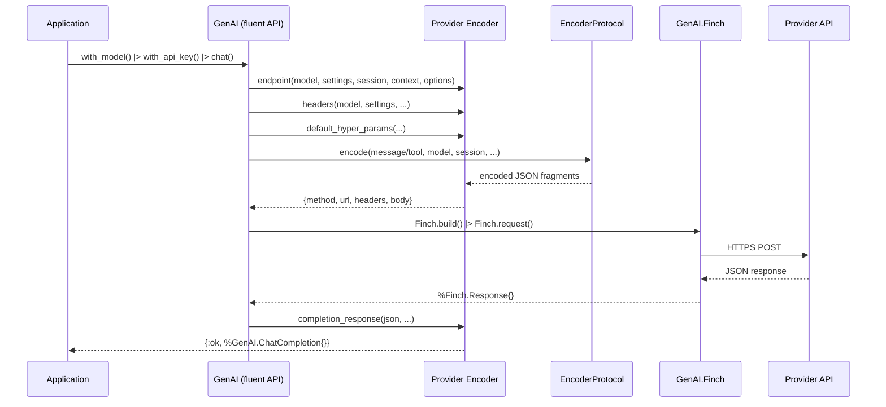

# Request Lifecycle

## Overview

A chat completion request flows through five stages, from user-facing fluent API to parsed response.

## Flow

## Stage Details

### 1. Settings Pipeline
The fluent `with_*` functions accumulate settings into a pipeline struct. Settings are layered with explicit precedence (options > model > provider > global > config).

### 2. Model Resolution
The model (string or `GenAI.Model` struct) is resolved via `GenAI.ModelProtocol` to determine which encoder to use.

### 3. Encoding
The encoder builds the HTTP request:
- **Endpoint**: Provider-specific URL (e.g., `/v1/messages` for Anthropic, `/v1/chat/completions` for OpenAI)
- **Headers**: Auth tokens, API versions, content type
- **Body**: Messages and tools encoded via `EncoderProtocol` implementations, hyperparameters merged from settings

### 4. HTTP Execution
`GenAI.Finch` (supervised connection pool) executes the request. All providers use Finch through the `api_call/3` helper in the provider behaviour.

### 5. Response Parsing
The encoder's `completion_response/6` parses the provider-specific JSON into standardized structs:
- `GenAI.ChatCompletion` — top-level response
- `GenAI.ChatCompletion.Choice` — individual completions
- `GenAI.ChatCompletion.Usage` — token counts
- `GenAI.Message` / `GenAI.Message.ToolUsage` — parsed message content
