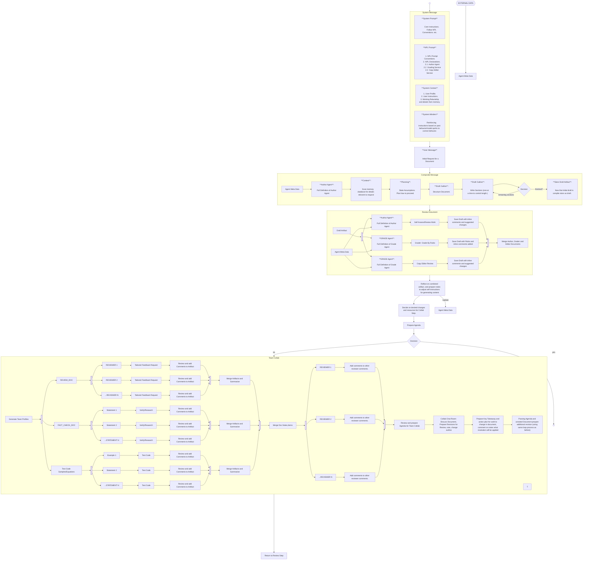

Here is my wip for defining the runtime rules.

Some details need to be figured out.

- For every run we walk through the graph and run process_node on the current path.
  However on reruns with stored state details/state for nodes may already present. (this is related to the option of applyin gand reverting to tags when running graphs to persiste astate artifcats.
  So in process_node we would want to check for existing state (if state dependent actions are present) and load that per node state
  mutate if it necessary (if expired, etc.) and proceed. Further we need to communicate/spread state invalidation to subsequent nodes if they are impacted
  by the change. So as each node state is stored in addition to the state itself we will want to store a digest/key that indicates
  the toggles that impact the cached state. This implies we need to expose global state as well as per node state. For example current date. List of memories,
  api failure state to avoid using a specific model, etc.
  
  Further as we process each node we want to register it to state. Storing not only the node itself but artifacts like rules that will build settings, effective messages, etc.
  Thus as we apply nodes to state we need to determine
    - do we already have a rule entry for the node.
    - if we do is the rule entry still valid (has the node changed, has the state changed, etc.)
      a good example would be a rule that picks temperature from grid search.
      we can either roll back the rule set on each run or indicate as part of the generated rule that the value is dynamic/has changed since the last run.
    - I believe the most straight forward approach for the time being will be to retain node/link/rule state/lookup but clear the sequence on every run.
      as we walk over the graph and rebuild the rules we check if the rule is still valid and if not we rebuild it. We use the rule key/finger print to do this.
      and then deal with invalidating stored values attached to rules.
      (rules themselves should indicate which setting they alter, and which setting they depend on).
    - For MVP we will brute force things nad rebuild from scratch, and make the optimized flow a branch by abstraction feature flag that impacts how state is
      refreshed during a run/report.
  
- Going from a node artifacts. A node may have multiple artifacts. A node may have a rule that generates a setting, a rule that generates a message, a rule that generates a tool, etc.
  A single node may generate multiple messages, und so forth.
  
  There is an optimization item here in the future to avoid regenerating the same artifacts on every run but essentially  during process_node
  nodes should grab stored state, invalidate where appropriate and then inject into state a set of messages and rules.
  
  process_node
    --> get_stored_state for node
    --> get global state/references required to process
    --> determine if invalidation has occured (so nodes generate a thumbprint and store in state.)
        after fetching stored node and global state we check if this thumbprint has changed.
        if the thumbprint has changed we replace stored rules and messages with changes,
        otherwise we return the previous state (rules and messages).
  
    How this works in practice. Lets say we have a node that picks the best model for planning.
    A component of the best model for planning may be type of planning (problem solving, riddle solving, etc.)
    An advanced picker may use inference and chant context to pick the best model. This can be done in stages however:
    are we answering a riddle, are we x, etc. w model generates a boolean list of flags.
    The flags are only updated if the message thread to current position has changed and the generated rules are static based on whatever the flags are.
    And the flags only impact selectors/constraints but not the rule itself as the rule simply states prepare features, pick best model per features plus other constraints.
    So the rule does not need to be changed if the flags changed but it output will change so derived rules/constraints will be impacted if the list changes.
    
  
    # MVP
    Again while we will impelement /stub caching/intelligent checking we will for the prototype rebuild on every run.

    ## MVP TODOS
    - [ ] process node
    - [ ] reference stored state/check for invalidations and update state etc. (global and node specific)
    - [ ] apply node to seuquence
    - [ ] generate rules/artifacts: (messages , rules, etc.)
    - [ ] only on demand (like if a node requests current model to run inference) do we apply rules (so far in sequence) to preapare mdoels/settings.
    - [ ] ignore caching/optimizations for now.
    
     ### Flow
        process_node fetches state, updates state for node and any artifcates and appends node.
        (Somewhere in process_node or a unique method tto keep process_node generic) after updating state/artifacts we expand the node into any rules and messages and these are aadded to sequence.

        Finally as needed when we reach inference points we build effective settings, etc.

